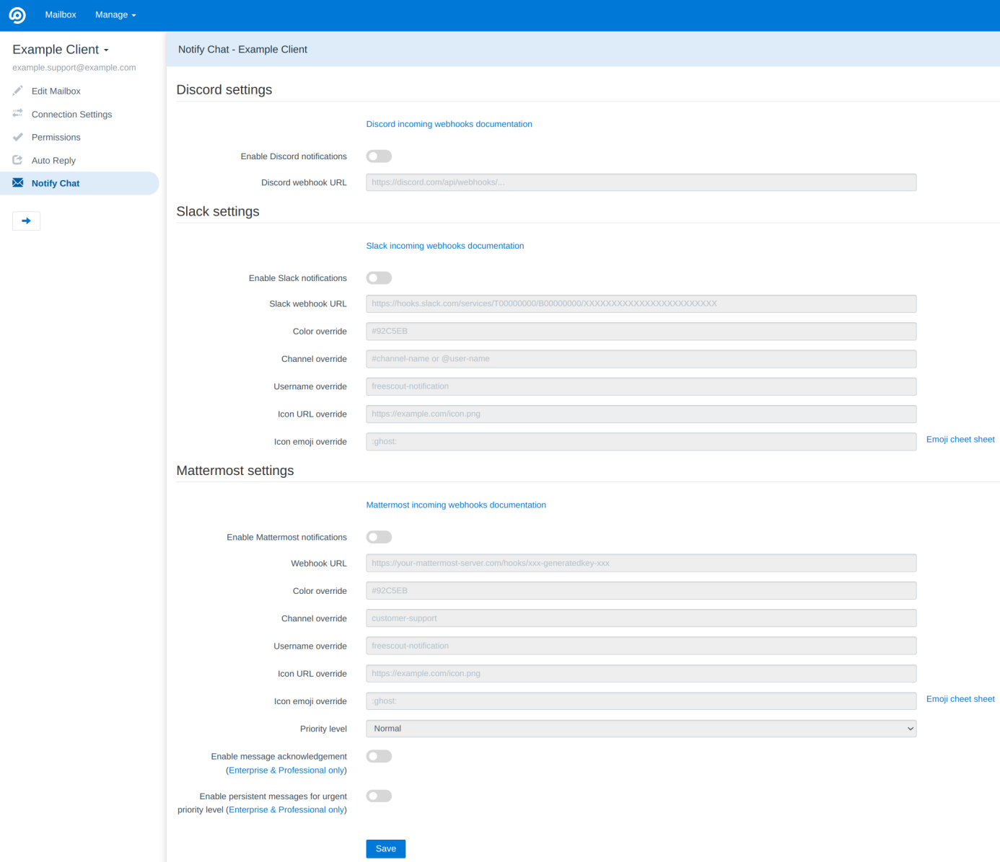
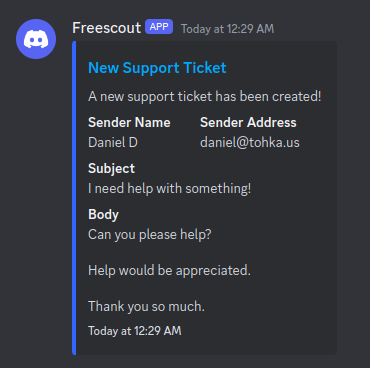
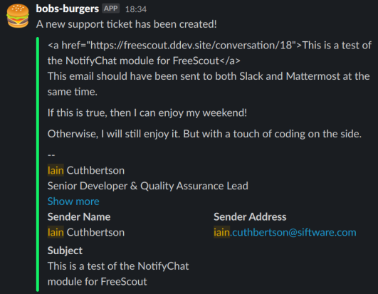
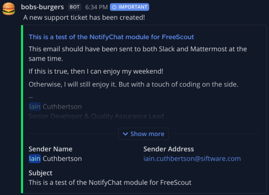
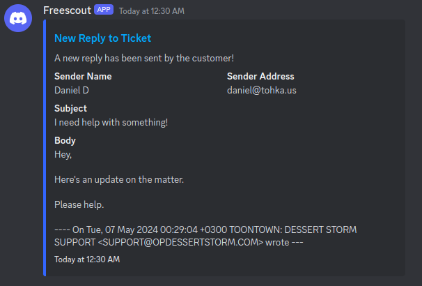
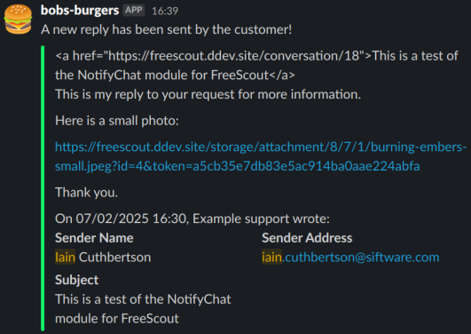
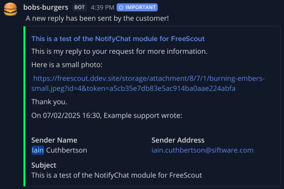

# Multiple chat notifications module for FreeScout

This module sends a notification to a channel on Discord, Slack, or Mattermost (more to be added):
- when a new support ticket is created by a customer
- when an existing support ticket receives a new reply from a customer.

## Installation

1. Navigate to your Modules folder e.g. `cd /var/www/html/Modules`
2. Run `git clone https://github.com/bigcalm/FreescoutNotifyChatModule.git NotifyChat`
3. Activate the module "Notify Chat" via the Modules page in FreeScout.
4. Create a new webhook on your communication platform of choice and copy the URL into the relevant field.
5. Set up the webhook URL in each mailbox you wish to receive notifications in.

## Update

1. Deactivate the NotifyChat module
2. Navigate to your Modules folder e.g. `cd /var/www/html/Modules`
3. Delete the NotifyChat module
4. Run `git clone https://github.com/bigcalm/FreescoutNotifyChatModule.git NotifyChat`
5. Activate the module "Notify Chat" via the Modules page in FreeScout. Your existing settings should have been retained.

## Translations

- English

## Screenshots

Settings:

Customer created new ticket:

`Discord`:

`Slack`:

`Mattermost`:

Customer updated existing ticket:

`Slack`:

`Mattermost`:

Honourable mentions:

This module is a fork of [darktohka/FreescoutDiscordModule](https://github.com/darktohka/FreescoutDiscordModule) which is limited to sending messages only to Discord.

Thank you for your primer!
